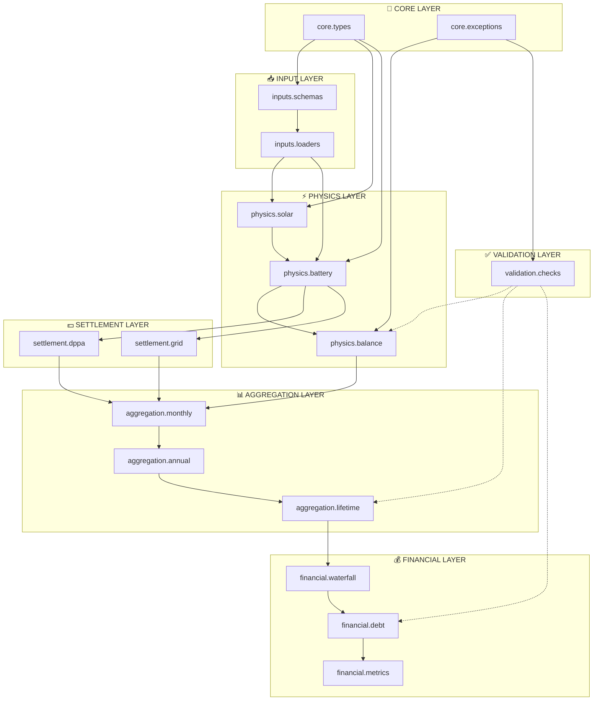

# Implementation Specification — RE-Storage Financial Model

> **Purpose:** Technical blueprint for implementing the Python simulation engine based on `model_architecture.md`.

---

## 1. Module Architecture

### 1.1 Module Dependency Graph



### 1.2 Module Specifications

---

#### Module: `core.types`

**Purpose:** Define domain-specific type aliases and enumerations for type safety.

```python
from enum import Enum, auto
from typing import TypeAlias
import pandas as pd

# Type Aliases
HourlyTimeSeries: TypeAlias = pd.DataFrame  # Index: datetime, 8760 rows
MonthlyTimeSeries: TypeAlias = pd.DataFrame  # Index: month (1-12)
AnnualTimeSeries: TypeAlias = pd.DataFrame   # Index: year (1-25)

# Physical Units (for documentation, not runtime enforcement)
PowerKW: TypeAlias = float
EnergyKWH: TypeAlias = float
EnergyMWH: TypeAlias = float
PriceUSDPerKWH: TypeAlias = float
Ratio: TypeAlias = float  # 0.0 to 1.0
Percentage: TypeAlias = float  # 0.0 to 100.0

class StrategyMode(Enum):
    """Battery dispatch strategy."""
    ARBITRAGE = 1      # Maximize time-of-use arbitrage
    PEAK_SHAVING = 2   # Minimize demand charges

class ChargingMode(Enum):
    """PV-to-BESS charging strategy."""
    TIME_WINDOW = 1    # Charge during specific hours
    PRECHARGE_TARGET = 2  # Charge to target SoC by specific hour

class TimePeriod(Enum):
    """Electricity tariff period classification."""
    OFF_PEAK = auto()
    STANDARD = auto()
    PEAK = auto()
```

---

#### Module: `core.exceptions`

**Purpose:** Domain-specific exceptions for clear error handling.

```python
class REStorageError(Exception):
    """Base exception for all RE-Storage model errors."""
    pass

class EnergyBalanceError(REStorageError):
    """Energy inputs do not equal outputs + losses."""
    pass

class SoCBoundsError(REStorageError):
    """State of Charge exceeded [0, max_capacity] bounds."""
    pass

class InsufficientCapacityError(REStorageError):
    """Requested power exceeds equipment rating."""
    pass

class InputValidationError(REStorageError):
    """Input data failed schema validation."""
    pass

class DegradationTableError(REStorageError):
    """Loss/degradation table is incomplete or malformed."""
    pass

class DSCRConstraintError(REStorageError):
    """Debt sizing failed to satisfy DSCR covenant."""
    pass
```

---

#### Module: `inputs.schemas`

**Purpose:** Pydantic models for strict input validation.

```python
from pydantic import BaseModel, Field, field_validator
from datetime import datetime

class SystemAssumptions(BaseModel):
    """Global system parameters from Assumption sheet."""
    
    # Capacity
    simulation_capacity_kwp: float = Field(gt=0, description="PVsyst model capacity")
    actual_capacity_kwp: float = Field(gt=0, description="Installed capacity")
    usable_bess_capacity_kwh: float = Field(ge=0, description="Net battery capacity")
    bess_power_rating_kw: float = Field(ge=0, description="Battery power limit")
    
    # Efficiency
    charge_efficiency: float = Field(ge=0.5, le=1.0)
    discharge_efficiency: float = Field(ge=0.5, le=1.0)
    
    # Strategy
    strategy_mode: int = Field(ge=1, le=2, description="1=Arbitrage, 2=Peak Shaving")
    charging_mode: int = Field(ge=1, le=2, description="1=Time Window, 2=Precharge")
    
    # Time windows
    charge_start_hour: int = Field(ge=0, le=23)
    charge_end_hour: int = Field(ge=0, le=23)
    precharge_target_hour: int = Field(ge=0, le=23)
    precharge_target_soc_kwh: float = Field(ge=0)
    
    # Constraints
    min_direct_pv_share: float = Field(ge=0, le=1.0, description="Min PV to load")
    active_pv2bess_share: float = Field(ge=0, le=1.0, description="Max PV to battery")
    demand_reduction_target: float = Field(ge=0, le=1.0)
    
    # DPPA
    strike_price_usd_per_kwh: float = Field(ge=0)
    k_factor: float = Field(gt=0, description="Loss adjustment factor")
    kpp: float = Field(gt=0, description="Price adjustment coefficient")
    
    # Toggles
    bess_enabled: bool
    dppa_enabled: bool
    
    @property
    def scale_factor(self) -> float:
        """Output scale factor to convert simulation to actual capacity."""
        return self.actual_capacity_kwp / self.simulation_capacity_kwp

class HourlyInputRow(BaseModel):
    """Single row of hourly time series data."""
    datetime: datetime
    simulation_profile_kw: float = Field(ge=0)
    irradiation_wh_m2: float = Field(ge=0)
    load_kw: float = Field(ge=0)
    fmp_usd_per_kwh: float  # Can be negative in some markets
    cfmp_usd_per_kwh: float

class DegradationRow(BaseModel):
    """Annual degradation factors from Loss sheet."""
    year: int = Field(ge=1, le=30)
    pv_factor: float = Field(gt=0, le=1.0, description="PV output multiplier")
    battery_factor_no_replacement: float = Field(gt=0, le=1.0)
    battery_factor_with_replacement: float = Field(gt=0, le=1.0)
```

---

#### Module: `inputs.loaders`

**Purpose:** Load and validate data from Excel/CSV sources.

**Key Functions:**

| Function | Input | Output | Notes |
|----------|-------|--------|-------|
| `load_assumptions(path)` | Excel path | `SystemAssumptions` | Reads Assumption sheet |
| `load_hourly_data(path)` | Excel path | `HourlyTimeSeries` | Validates 8760/8784 rows |
| `load_degradation_table(path)` | Excel path | `pd.DataFrame` | Validates 25-year coverage |
| `load_tariff_schedule(path)` | Excel path | `dict` | Peak/off-peak definitions |

**Edge Case Handling:**
```python
def load_hourly_data(path: Path) -> HourlyTimeSeries:
    """
    Load hourly time series with leap year handling.
    
    Raises:
        InputValidationError: If row count not in {8760, 8784}
    """
    df = pd.read_excel(path, sheet_name="Data Input")
    
    if len(df) not in (8760, 8784):
        raise InputValidationError(
            f"Expected 8760 or 8784 rows, got {len(df)}. "
            "Check for leap year or incomplete data."
        )
    return df
```

---

#### Module: `physics.solar`

**Purpose:** Solar generation calculations.

**Key Functions:**

| Function | Formula Reference | Description |
|----------|-------------------|-------------|
| `scale_generation(profile, factor)` | §A.1 | Apply output scale factor |
| `calculate_direct_consumption(solar, load, pv2bess)` | Col I | `MIN(Load, MAX(Solar - PV2BESS, 0))` |
| `calculate_surplus(solar, direct, charged)` | Col Z | Excess generation to grid |

---

#### Module: `physics.battery`

**Purpose:** Battery dispatch engine — the core complexity.

**Key Functions:**

| Function | Formula Reference | Description |
|----------|-------------------|-------------|
| `calculate_charge_limit(soc, max_capacity, efficiency)` | — | Available charge headroom |
| `calculate_pv_to_bess(...)` | §A.2 | Mode 1 & 2 charging logic |
| `evaluate_discharge_permission(...)` | §A.3 | 4-condition discharge decision |
| `calculate_discharge_power(...)` | Col V | Actual discharge rate |
| `update_soc(...)` | §A.4 | Bounded SoC update |
| `run_hourly_dispatch(hourly_data, assumptions)` | Full Calc | Main dispatch loop |

**Discharge Permission Logic (Critical):**

```python
def evaluate_discharge_permission(
    strategy_mode: StrategyMode,
    hour: int,
    load_kw: float,
    solar_kw: float,
    grid_load_kw: float,
    demand_target_kw: float,
    is_peak_period: bool,
    is_sunday: bool,
    # Flags from assumptions
    when_needed: bool,
    after_sunset: bool,
    optimize_mode: bool,
    peak_mode: bool,
) -> bool:
    """
    Determine if battery discharge is permitted this timestep.
    
    This implements the complex 4-condition OR logic from Calc!Col J.
    
    IMPORTANT: Conditions are evaluated with OR logic, meaning ANY
    single TRUE condition enables discharge. This can cause unexpected
    discharge during off-peak periods if flags overlap.
    
    Risk Mitigation: Log when multiple conditions are TRUE simultaneously
    to aid debugging of unexpected discharge behavior.
    """
    if strategy_mode == StrategyMode.PEAK_SHAVING:
        # Simple: discharge only when exceeding demand target
        return grid_load_kw > demand_target_kw
    
    # Arbitrage mode: OR of 4 conditions
    conditions = {
        "when_needed": when_needed and (load_kw > solar_kw),
        "after_sunset": after_sunset and (hour >= 17),
        "optimize": optimize_mode and (is_in_optimization_window(hour) or is_peak_period),
        "peak": peak_mode and (is_peak_period or (is_sunday and is_sunday_peak_window(hour))),
    }
    
    active_conditions = [k for k, v in conditions.items() if v]
    
    if len(active_conditions) > 1:
        logger.warning(
            f"Multiple discharge conditions active: {active_conditions}. "
            "Review dispatch strategy for unintended overlap."
        )
    
    return any(conditions.values())
```

---

#### Module: `physics.balance`

**Purpose:** Energy balance validation — the "Physics First" enforcement.

**Key Functions:**

```python
def validate_energy_balance(
    solar_gen_kwh: float,
    direct_consumption_kwh: float,
    charged_kwh: float,
    surplus_kwh: float,
    tolerance: float = 0.001,
) -> None:
    """
    Validate: Solar = Direct + Charged + Surplus (within tolerance).
    
    This is the Python equivalent of Calc!Col R (Balance_Check).
    
    Raises:
        EnergyBalanceError: If balance exceeds tolerance.
    """
    balance = solar_gen_kwh - (direct_consumption_kwh + charged_kwh + surplus_kwh)
    
    if abs(balance) > tolerance:
        raise EnergyBalanceError(
            f"Energy balance failed: {balance:.4f} kWh imbalance. "
            f"Solar={solar_gen_kwh:.2f}, Direct={direct_consumption_kwh:.2f}, "
            f"Charged={charged_kwh:.2f}, Surplus={surplus_kwh:.2f}"
        )

def validate_soc_bounds(
    soc_kwh: float,
    max_capacity_kwh: float,
    timestep: int,
) -> None:
    """
    Validate SoC stays within [0, max_capacity].
    
    Raises:
        SoCBoundsError: If SoC is negative or exceeds capacity.
    """
    if soc_kwh < -0.001:  # Small tolerance for floating point
        raise SoCBoundsError(f"Negative SoC at timestep {timestep}: {soc_kwh:.4f} kWh")
    
    if soc_kwh > max_capacity_kwh + 0.001:
        raise SoCBoundsError(
            f"SoC exceeds capacity at timestep {timestep}: "
            f"{soc_kwh:.4f} > {max_capacity_kwh:.4f} kWh"
        )
```

---

#### Module: `settlement.dppa`

**Purpose:** Vietnam DPPA/CfD revenue calculations.

**Key Functions:**

| Function | Formula Reference | Description |
|----------|-------------------|-------------|
| `calculate_delivered_re(net_gen, k_factor, kpp, delta)` | Col H | Loss-adjusted delivery |
| `calculate_consumed_re(delivered, load)` | Col I | `MIN(Load, Delivered)` |
| `calculate_market_revenue(net_gen, fmp)` | Col G | Spot market revenue |
| `calculate_cfd_settlement(consumed, strike, spot)` | Col P | Top-up or payback |
| `calculate_total_dppa_revenue(...)` | Col Q | Rg + R_CFD |

**DPPA Activation Guard:**

```python
def calculate_dppa_revenue(
    hourly_data: HourlyTimeSeries,
    assumptions: SystemAssumptions,
) -> pd.DataFrame:
    """
    Calculate DPPA settlement for all hours.
    
    WARNING: If assumptions.dppa_enabled is False, all revenue = 0.
    This can silently produce incorrect financials if the flag is
    accidentally disabled.
    """
    if not assumptions.dppa_enabled:
        logger.warning(
            "DPPA module is DISABLED (dppa_enabled=False). "
            "All DPPA revenue will be zero. Verify this is intentional."
        )
        return _create_zero_dppa_result(hourly_data)
    
    # ... actual calculation
```

---

#### Module: `settlement.grid`

**Purpose:** Grid expense and savings calculations.

**Key Functions:**

| Function | Description |
|----------|-------------|
| `calculate_bau_expense(load, tariff_schedule)` | Business-as-usual grid cost |
| `calculate_re_expense(grid_load_after_re, tariff_schedule)` | Grid cost with solar+BESS |
| `calculate_demand_charges(peak_demand, rate)` | Monthly demand charges |
| `calculate_grid_savings(bau, re)` | BAU - RE expense |

---

#### Module: `aggregation.monthly`

**Purpose:** Hourly → Monthly rollup (mirrors `Helper` sheet).

**Key Functions:**

```python
def aggregate_hourly_to_monthly(
    hourly_data: HourlyTimeSeries,
) -> MonthlyTimeSeries:
    """
    Aggregate hourly simulation results to monthly summaries.
    
    Output columns:
    - baseline_peak_kw: MAX(Load) per month
    - demand_target_kw: baseline_peak * (1 - reduction_target)
    - bau_grid_expense: SUM(BAU expense) per month
    - re_grid_expense: SUM(RE expense) per month
    - peak_demand_after_solar_kw: MAX(GridLoadAfterSolar) per month
    - peak_demand_after_re_kw: MAX(GridLoadAfterSolar+BESS) per month
    """
    monthly = hourly_data.groupby(hourly_data["datetime"].dt.month).agg({
        "load_kw": "max",
        "bau_expense": "sum",
        "re_expense": "sum",
        "grid_load_after_solar_kw": "max",
        "grid_load_after_re_kw": "max",
    })
    
    monthly.columns = [
        "baseline_peak_kw",
        "bau_grid_expense",
        "re_grid_expense", 
        "peak_demand_after_solar_kw",
        "peak_demand_after_re_kw",
    ]
    
    return monthly
```

---

#### Module: `aggregation.annual`

**Purpose:** Monthly → Annual totals (mirrors `Measures` sheet).

**Key Functions:**

| Function | Description |
|----------|-------------|
| `calculate_year1_totals(monthly, hourly, dppa)` | Aggregate to Year 1 metrics |
| `calculate_total_solar_generation(hourly, scale_factor)` | SUM(SolarGen) × scale |
| `calculate_total_dppa_revenue(dppa_hourly)` | SUM(R_total) |

---

#### Module: `aggregation.lifetime`

**Purpose:** Year 1 → 25-year projection with degradation.

**Key Functions:**

```python
def project_lifetime_generation(
    year1_generation_mwh: float,
    degradation_table: pd.DataFrame,
    project_years: int = 25,
) -> pd.Series:
    """
    Project solar generation across project lifetime with degradation.
    
    Args:
        year1_generation_mwh: Base year generation
        degradation_table: Must have 'year' and 'pv_factor' columns
        project_years: Typically 25
        
    Returns:
        Series indexed by year (1 to project_years)
        
    Raises:
        DegradationTableError: If table doesn't cover all project years
    """
    if degradation_table["year"].max() < project_years:
        raise DegradationTableError(
            f"Degradation table only covers {degradation_table['year'].max()} years, "
            f"but project requires {project_years} years."
        )
    
    factors = degradation_table.set_index("year")["pv_factor"]
    return pd.Series(
        [year1_generation_mwh * factors.loc[y] for y in range(1, project_years + 1)],
        index=range(1, project_years + 1),
        name="generation_mwh",
    )

def project_battery_capacity(
    initial_capacity_kwh: float,
    degradation_table: pd.DataFrame,
    replacement_cycle: int = 11,
    project_years: int = 25,
) -> pd.Series:
    """
    Project battery capacity with degradation AND augmentation events.
    
    Battery augmentation resets capacity at years 11 and 22 (configurable).
    This mirrors the behavior in Loss!Col F.
    
    Args:
        initial_capacity_kwh: Starting usable capacity
        degradation_table: Contains 'battery_factor_with_replacement'
        replacement_cycle: Years between augmentation (default 11)
        project_years: Typically 25
        
    Returns:
        Series of effective capacity per year
        
    Note:
        The Excel model resets to ~97.45% of initial (Year 2 equivalent),
        not 100%. This assumes some initial settling losses.
    """
    factors = degradation_table.set_index("year")["battery_factor_with_replacement"]
    return pd.Series(
        [initial_capacity_kwh * factors.loc[y] for y in range(1, project_years + 1)],
        index=range(1, project_years + 1),
        name="battery_capacity_kwh",
    )
```

---

#### Module: `financial.waterfall`

**Purpose:** Cash flow waterfall construction.

**Key Functions:**

```python
def build_cash_flow_waterfall(
    lifetime_revenue: pd.DataFrame,
    lifetime_opex: pd.DataFrame,
    debt_schedule: pd.DataFrame,
    capex: dict,
) -> pd.DataFrame:
    """
    Construct annual cash flow waterfall.
    
    Structure:
    ┌─────────────────────────────────────┐
    │  DPPA Revenue                        │
    │  + Grid Savings                      │
    │  + Demand Charge Savings             │
    │  = TOTAL REVENUE                     │
    ├─────────────────────────────────────┤
    │  - O&M Costs                         │
    │  - Insurance                         │
    │  - Land Lease                        │
    │  - Management Fees                   │
    │  = EBITDA                            │
    ├─────────────────────────────────────┤
    │  - Interest                          │
    │  - Principal                         │
    │  = CFADS (Cash Flow for Debt Service)│
    ├─────────────────────────────────────┤
    │  - Taxes                             │
    │  - MRA Contributions                 │
    │  = Free Cash Flow to Equity          │
    └─────────────────────────────────────┘
    """
    ...
```

---

#### Module: `financial.debt`

**Purpose:** Debt sizing and DSCR calculations.

**Key Functions:**

```python
def size_debt_for_dscr(
    ebitda_series: pd.Series,
    interest_rate: float,
    tenor_years: int,
    target_dscr: float,
    initial_guess: float,
) -> tuple[float, pd.DataFrame]:
    """
    Find maximum debt that satisfies DSCR covenant in all years.
    
    This replaces the VBA GoalSeek macro with scipy.optimize.
    
    Algorithm:
    1. Start with initial guess (capacity-based debt)
    2. Calculate amortization schedule
    3. Calculate DSCR for each year
    4. Find minimum DSCR
    5. Iterate until min(DSCR) == target_DSCR
    
    Args:
        ebitda_series: Annual EBITDA values
        interest_rate: Annual interest rate (e.g., 0.08 for 8%)
        tenor_years: Debt repayment period
        target_dscr: Minimum acceptable DSCR (e.g., 1.3)
        initial_guess: Starting debt amount (e.g., $5M)
        
    Returns:
        Tuple of (optimal_debt_amount, debt_service_schedule)
        
    Raises:
        DSCRConstraintError: If no feasible debt amount exists
    """
    from scipy.optimize import brentq
    
    def dscr_residual(debt_amount: float) -> float:
        schedule = calculate_amortization(debt_amount, interest_rate, tenor_years)
        dscr_values = ebitda_series / schedule["total_debt_service"]
        return dscr_values.min() - target_dscr
    
    try:
        optimal_debt = brentq(dscr_residual, 0, initial_guess * 2)
    except ValueError:
        raise DSCRConstraintError(
            f"Cannot find debt amount satisfying DSCR >= {target_dscr}. "
            "EBITDA may be insufficient for any debt service."
        )
    
    final_schedule = calculate_amortization(optimal_debt, interest_rate, tenor_years)
    return optimal_debt, final_schedule
```

---

#### Module: `financial.metrics`

**Purpose:** Return metric calculations.

**Key Functions:**

| Function | Excel Equivalent | Output |
|----------|------------------|--------|
| `calculate_project_irr(cashflows, dates)` | `XIRR(K121:AJ121, K6:AJ6)` | Project IRR |
| `calculate_equity_irr(equity_cashflows, dates)` | `XIRR(K134:AJ134, K6:AJ6)` | Equity IRR |
| `calculate_npv(cashflows, dates, discount_rate)` | `XNPV(...)` | Net Present Value |
| `calculate_dscr_series(ebitda, debt_service)` | — | Annual DSCR values |

---

#### Module: `validation.checks`

**Purpose:** Cross-cutting validation and warnings.

**Key Functions:**

```python
def validate_full_model(
    hourly_results: HourlyTimeSeries,
    monthly_results: MonthlyTimeSeries,
    lifetime_results: pd.DataFrame,
    assumptions: SystemAssumptions,
) -> list[str]:
    """
    Run all validation checks and return list of warnings.
    
    Checks performed:
    1. Energy balance at each timestep
    2. SoC bounds at each timestep
    3. DPPA revenue non-zero (if enabled)
    4. Degradation table covers all years
    5. Battery augmentation years align with MRA funding
    6. Tariff escalation sanity check
    """
    warnings = []
    
    # Check DPPA revenue
    if assumptions.dppa_enabled:
        total_dppa = lifetime_results["dppa_revenue"].sum()
        if total_dppa == 0:
            warnings.append(
                "WARNING: DPPA is enabled but total revenue is $0. "
                "Check DPPA calculation inputs."
            )
    
    # Check for augmentation cost alignment
    aug_years = [11, 22]  # From Loss sheet analysis
    for year in aug_years:
        if year <= len(lifetime_results):
            aug_cost = lifetime_results.loc[year, "augmentation_capex"]
            mra_balance = lifetime_results.loc[year - 1, "mra_balance"]
            if aug_cost > mra_balance:
                warnings.append(
                    f"WARNING: Year {year} augmentation cost (${aug_cost:,.0f}) "
                    f"exceeds MRA balance (${mra_balance:,.0f}). "
                    "Equity top-up required."
                )
    
    return warnings
```

---

## 2. Data Flow Diagram

### 2.1 Complete Pipeline

```
┌─────────────────────────────────────────────────────────────────────────────────┐
│                              INPUT STAGE                                         │
├─────────────────────────────────────────────────────────────────────────────────┤
│                                                                                  │
│   Excel File ──▶ inputs.loaders ──▶ Pydantic Validation ──▶ Clean DataFrames   │
│                                                                                  │
│   Outputs:                                                                       │
│   • SystemAssumptions (validated config)                                         │
│   • HourlyTimeSeries (8760 rows)                                                │
│   • DegradationTable (25 rows)                                                  │
│   • TariffSchedule (peak/off-peak definitions)                                  │
│                                                                                  │
└─────────────────────────────────────────────────────────────────────────────────┘
                                      │
                                      ▼
┌─────────────────────────────────────────────────────────────────────────────────┐
│                           PHYSICS SIMULATION STAGE                               │
├─────────────────────────────────────────────────────────────────────────────────┤
│                                                                                  │
│   FOR each hour in 8760:                                                         │
│   │                                                                              │
│   ├──▶ physics.solar.scale_generation()                                         │
│   │        └─▶ SolarGen_kW = Profile × Scale_Factor                             │
│   │                                                                              │
│   ├──▶ physics.battery.calculate_pv_to_bess()                                   │
│   │        └─▶ PV2BESS_kW (based on charging mode)                              │
│   │                                                                              │
│   ├──▶ physics.solar.calculate_direct_consumption()                             │
│   │        └─▶ DirectPV_kW = MIN(Load, Solar - PV2BESS)                         │
│   │                                                                              │
│   ├──▶ physics.battery.evaluate_discharge_permission()                          │
│   │        └─▶ Boolean: Can battery discharge?                                  │
│   │                                                                              │
│   ├──▶ physics.battery.calculate_discharge_power()                              │
│   │        └─▶ Discharge_kW (constrained by SoC, rating)                        │
│   │                                                                              │
│   ├──▶ physics.battery.update_soc()                                             │
│   │        └─▶ SoC_kWh = BOUNDED[0, max](prev + charge - discharge)             │
│   │                                                                              │
│   └──▶ physics.balance.validate_energy_balance()                                │
│            └─▶ ASSERT: Solar = Direct + Charged + Surplus                       │
│                                                                                  │
│   Output: HourlyResults DataFrame (41 columns)                                  │
│                                                                                  │
└─────────────────────────────────────────────────────────────────────────────────┘
                                      │
                                      ▼
┌─────────────────────────────────────────────────────────────────────────────────┐
│                           SETTLEMENT STAGE                                       │
├─────────────────────────────────────────────────────────────────────────────────┤
│                                                                                  │
│   ┌─────────────────────────┐    ┌─────────────────────────┐                    │
│   │   settlement.dppa       │    │   settlement.grid       │                    │
│   ├─────────────────────────┤    ├─────────────────────────┤                    │
│   │ • Market revenue (Rg)   │    │ • BAU grid expense      │                    │
│   │ • CfD settlement (R_CFD)│    │ • RE grid expense       │                    │
│   │ • DPPA costs (CDN, CCL) │    │ • Demand charges        │                    │
│   │ • Total DPPA revenue    │    │ • Grid savings          │                    │
│   └─────────────────────────┘    └─────────────────────────┘                    │
│                                                                                  │
│   Output: HourlyResults with revenue columns appended                           │
│                                                                                  │
└─────────────────────────────────────────────────────────────────────────────────┘
                                      │
                                      ▼
┌─────────────────────────────────────────────────────────────────────────────────┐
│                           AGGREGATION STAGE                                      │
├─────────────────────────────────────────────────────────────────────────────────┤
│                                                                                  │
│   8760 Hourly ──▶ aggregation.monthly ──▶ 12 Monthly                            │
│                           │                                                      │
│                           ▼                                                      │
│                   aggregation.annual ──▶ Year 1 Totals                          │
│                           │                                                      │
│                           ▼                                                      │
│                   aggregation.lifetime ──▶ 25-Year Projection                   │
│                           │                                                      │
│                           ├── Apply PV degradation factors                      │
│                           ├── Apply battery degradation + augmentation          │
│                           └── Scale revenues and expenses                        │
│                                                                                  │
│   Output: LifetimeResults DataFrame (25 rows)                                   │
│                                                                                  │
└─────────────────────────────────────────────────────────────────────────────────┘
                                      │
                                      ▼
┌─────────────────────────────────────────────────────────────────────────────────┐
│                           FINANCIAL STAGE                                        │
├─────────────────────────────────────────────────────────────────────────────────┤
│                                                                                  │
│   ┌────────────────────────────────────────────────────────────────────────┐    │
│   │                    financial.waterfall                                  │    │
│   │   Revenue ─ Opex = EBITDA ─ Debt Service = CFADS ─ Tax = FCF           │    │
│   └────────────────────────────────────────────────────────────────────────┘    │
│                                      │                                          │
│                                      ▼                                          │
│   ┌────────────────────────────────────────────────────────────────────────┐    │
│   │                    financial.debt                                       │    │
│   │   size_debt_for_dscr() ──▶ Optimal debt satisfying DSCR covenant       │    │
│   └────────────────────────────────────────────────────────────────────────┘    │
│                                      │                                          │
│                                      ▼                                          │
│   ┌────────────────────────────────────────────────────────────────────────┐    │
│   │                    financial.metrics                                    │    │
│   │   • Project IRR: 5.07%                                                  │    │
│   │   • Equity IRR: 4.64%                                                   │    │
│   │   • Unlevered IRR: 8.83%                                               │    │
│   │   • NPV @ X%: -$2.65M                                                  │    │
│   └────────────────────────────────────────────────────────────────────────┘    │
│                                                                                  │
│   Output: FinancialSummary with all KPIs                                        │
│                                                                                  │
└─────────────────────────────────────────────────────────────────────────────────┘
```

---

## 3. Edge Case Handling Matrix

| Risk ID | Risk Description | Module | Mitigation Strategy |
|---------|-----------------|--------|---------------------|
| **R1** | Discharge strategy complexity (4 overlapping conditions) | `physics.battery` | Log when multiple conditions TRUE; add priority flag option |
| **R2** | Grid charging flag ambiguity (1 vs 2) | `physics.battery` | Explicit enum + docstring explaining each mode |
| **R3** | DPPA model activation switch silently zeros revenue | `settlement.dppa` | Warning log when disabled; validation check post-run |
| **R4** | Circular reference in debt sizing (VBA GoalSeek) | `financial.debt` | Replace with `scipy.optimize.brentq`; no circular refs |
| **R5** | Loss table incomplete (<25 years) | `aggregation.lifetime` | Raise `DegradationTableError` if years missing |
| **R6** | Balance check column unused | `physics.balance` | Make validation mandatory; raise `EnergyBalanceError` |
| **R7** | Battery augmentation jumps at Years 11 & 22 | `aggregation.lifetime` | Explicit augmentation events; verify MRA funding alignment |
| **R8** | Time series length (leap year) | `inputs.loaders` | Accept 8760 OR 8784 rows; reject others |
| **R9** | Exchange rate timing (single FX for 25 years) | `inputs.schemas` | Add optional annual FX series; default to constant |
| **R10** | Tariff escalation missing | `settlement.grid` | Add escalation_rate parameter; warn if 0% |

---

## 4. Testing Strategy

### 4.1 Unit Test Coverage Matrix

| Module | Key Functions | Test Focus |
|--------|---------------|------------|
| `inputs.loaders` | `load_hourly_data` | Leap year handling, missing columns |
| `physics.solar` | `scale_generation` | Scale factor = 1.0 identity |
| `physics.battery` | `evaluate_discharge_permission` | All 4 condition combinations |
| `physics.battery` | `update_soc` | Bounds enforcement at 0 and max |
| `physics.balance` | `validate_energy_balance` | Tolerance threshold testing |
| `settlement.dppa` | `calculate_cfd_settlement` | Positive/negative settlement |
| `aggregation.lifetime` | `project_battery_capacity` | Augmentation reset behavior |
| `financial.debt` | `size_debt_for_dscr` | No-feasible-debt case |
| `financial.metrics` | `calculate_project_irr` | Match Excel XIRR output |

### 4.2 Integration Test Scenarios

| Scenario | Description | Expected Outcome |
|----------|-------------|------------------|
| **Full Year Simulation** | Run 8760-hour dispatch with real data | Outputs match Excel within tolerance |
| **BESS Disabled** | Set `bess_enabled=False` | All battery columns = 0 |
| **DPPA Disabled** | Set `dppa_enabled=False` | Warning logged, revenue = 0 |
| **Peak Shaving Mode** | `strategy_mode=2` | Discharge only when > demand target |
| **Leap Year** | 8784-hour input file | No errors, correct aggregation |
| **Year 11 Augmentation** | Check capacity reset | Battery factor jumps to 0.9745 |

### 4.3 Regression Test: Excel Comparison

```python
def test_regression_against_excel():
    """
    Verify Python outputs match Excel reference values.
    
    Reference: AUDIT 20251201 40MW Solar BESS Ecoplexus.xlsx
    """
    # Load reference values
    expected = {
        "project_irr": 0.0507,      # 5.07%
        "equity_irr": 0.0464,       # 4.64%
        "unlevered_irr": 0.0883,    # 8.83%
        "npv_usd": -2_650_000,      # -$2.65M
    }
    
    # Run Python model
    results = run_full_model("test_data/excel_export.csv")
    
    # Assert within tolerance
    assert abs(results.project_irr - expected["project_irr"]) < 0.0001
    assert abs(results.equity_irr - expected["equity_irr"]) < 0.0001
    assert abs(results.npv_usd - expected["npv_usd"]) / abs(expected["npv_usd"]) < 0.0001
```

---

## 5. Implementation Roadmap

### Phase 1: Foundation (Week 1)
- [ ] Set up project structure (`pyproject.toml`, `src/`, `tests/`)
- [ ] Implement `core.types` and `core.exceptions`
- [ ] Implement `inputs.schemas` with Pydantic models
- [ ] Implement `inputs.loaders` with Excel reader
- [ ] Write unit tests for input validation

### Phase 2: Physics Engine (Week 2)
- [ ] Implement `physics.solar` (scale, direct consumption)
- [ ] Implement `physics.battery` (dispatch logic, SoC tracking)
- [ ] Implement `physics.balance` (validation)
- [ ] Write property-based tests for SoC bounds

### Phase 3: Settlement (Week 3)
- [ ] Implement `settlement.dppa` (CfD calculations)
- [ ] Implement `settlement.grid` (tariff application)
- [ ] Write unit tests for DPPA edge cases

### Phase 4: Aggregation (Week 4)
- [ ] Implement `aggregation.monthly`
- [ ] Implement `aggregation.annual`
- [ ] Implement `aggregation.lifetime` (with degradation)
- [ ] Write tests for augmentation reset behavior

### Phase 5: Financial (Week 5)
- [ ] Implement `financial.waterfall`
- [ ] Implement `financial.debt` (DSCR optimization)
- [ ] Implement `financial.metrics` (IRR, NPV)
- [ ] Write regression tests against Excel

### Phase 6: Integration & Documentation (Week 6)
- [ ] Full integration tests
- [ ] Validation module
- [ ] API documentation (Sphinx)
- [ ] User guide

---

*Document Version: 1.0*  
*Created: 2026-01-29*  
*Last Updated: 2026-01-29*
