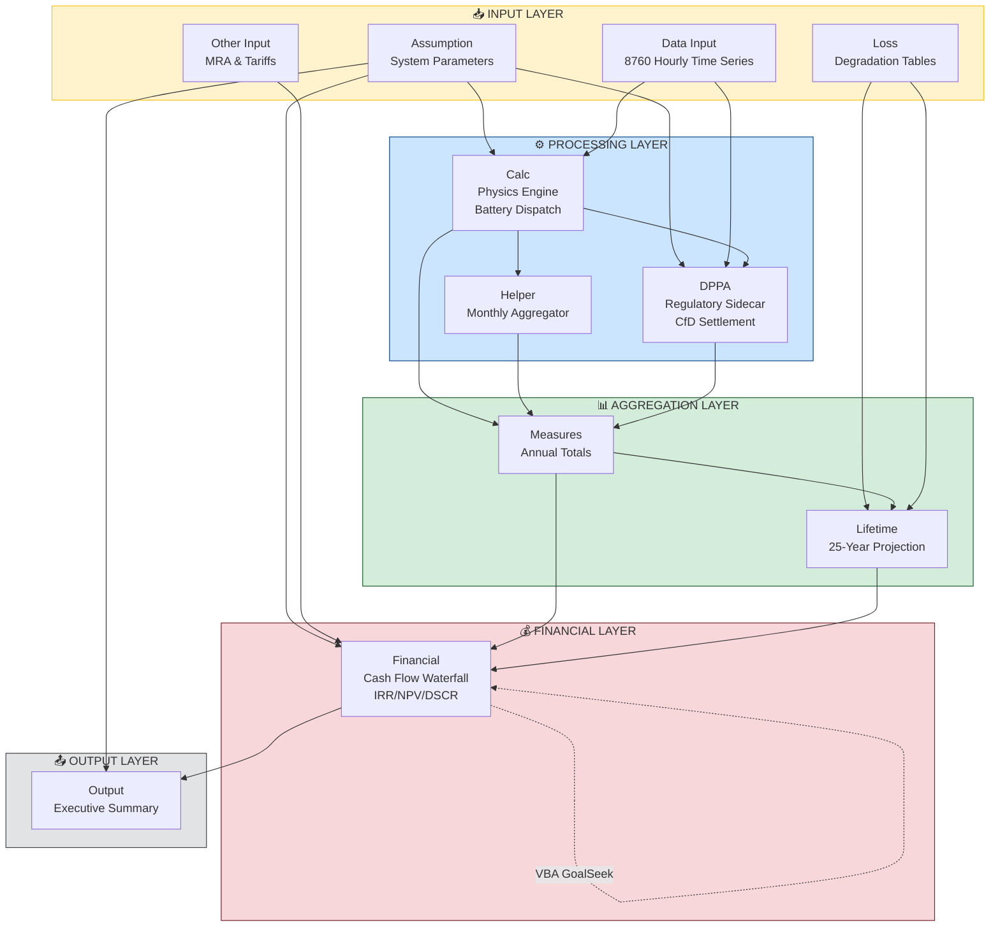

# System Architecture & Dataflow Report

**Model:** 40MW Solar + BESS Financial Model (Ecoplexus)

**Document Type:** Technical Architecture Specification

---

## 1. High-Level System Topology

### 1.1 Sheet Classification

| Layer | Sheets | Role |
|-------|--------|------|
| **Inputs** | `Assumption`, `Data Input`, `Other Input`, `Loss` | Source data & parameters |
| **Processing** | `Calc`, `Helper`, `DPPA` | Hourly simulation engines |
| **Aggregation** | `Measures`, `Lifetime` | Time-scale bridging (hourly → annual → lifetime) |
| **Financials** | `Financial` | Cash flow waterfall & returns |
| **Outputs** | `Output` | Executive summary & KPIs |

### 1.2 System Flowchart



### 1.3 Simplified Data Pipeline

```
┌─────────────┐    ┌─────────────┐    ┌─────────────┐    ┌─────────────┐    ┌─────────────┐
│  Data Input │───▶│    Calc     │───▶│   Helper    │───▶│  Measures   │───▶│  Financial  │───▶ Output
│  (8760 hrs) │    │  (Dispatch) │    │  (Monthly)  │    │  (Annual)   │    │  (25 Years) │
└─────────────┘    └─────────────┘    └─────────────┘    └─────────────┘    └─────────────┘
                          │                                      ▲
                          ▼                                      │
                   ┌─────────────┐                        ┌─────────────┐
                   │    DPPA     │────────────────────────│  Lifetime   │◀── Loss
                   │  (CfD/PPA)  │                        │ (Degraded)  │
                   └─────────────┘                        └─────────────┘
```

---

## 2. The Data Pipeline (Step-by-Step)

### Stage A: Physics Engine (Hourly Simulation)

**Sheet:** `Calc` (8761 rows × 41 columns)

**Input Sources:**
- `Data Input` → DateTime, SimulationProfile_kW, Irradiation, Load_kW, FMP, CFMP
- `Assumption` → System parameters (capacity, efficiency, strategy modes)

#### A.1 Solar Generation Scaling

```
SolarGen_kW (Col F) = SimulationProfile_kW × Output_Scale_Factor
```

**English:** The raw simulation profile (from PVsyst or similar) is scaled by a factor to match actual installed capacity vs. simulation capacity.

#### A.2 Battery Dispatch Logic (Decision Tree)

The battery dispatch uses a sophisticated `LET()` formula with multiple operating modes:

**Mode 1: Time-Window Arbitrage**
```
PVActive2BESS_kW (Col G) = 
  IF within charging window (ActivePV2BESS_StartHour to EndHour):
    IF NOT peak period AND ActivePV2BESS_Mode = 1:
      Divert (PV × ActivePV2BESS_Share) to battery
    ELSE:
      0
  CONSTRAINED BY:
    - Minimum direct PV share to load (Min_DirectPVShare × Load)
    - Available charge capacity (ChargeLimit_kWh / StepHours)
```

**Mode 2: Pre-charge to Target SoC**
```
IF ActivePV2BESS_Mode = 2 AND before Precharge_TargetHour:
  Charge at rate = (Target_SoC - Current_SoC) / (efficiency × dt)
```

#### A.3 Discharge Permission Logic

```
AllowDischarge (Col J) = 
  IF Strategy_mode = 1 (Arbitrage):
    Allow if ANY of:
      - When_Needed = 1 (load exceeds solar)
      - After_Sunset = 1 AND hour > 17
      - Optimize_mode AND (in optimization window OR peak period OR Sunday evening)
      - Peak = 1 AND (peak period OR Sunday peak windows)
  
  IF Strategy_mode = 2 (Peak Shaving):
    Allow if Grid_Load > DemandTarget_kW
```

#### A.4 State of Charge Tracking

```
SoC_kWh (Col M) = BOUNDED[0, Usable_BESS_Capacity](
  Previous_SoC 
  + TotalCharged × Charge_Efficiency 
  - Discharged / Discharge_Efficiency
)
```

**Key Variables Computed:**
| Column | Variable | Formula Logic |
|--------|----------|---------------|
| I | DirectPVConsumption_kW | `MIN(Load, MAX(Solar - PV2BESS, 0))` |
| Q | PVCharged_kWh | Active charging + excess solar charging |
| S | GridCharged_kWh | Grid charging (if allowed by flag) |
| V | DischargePower_kW | Controlled by dispatch algorithm |
| Y | GridLoadAfterSolar+BESS_kW | Net grid import after all RE |
| AB | NetGenForDPPA_kW | Net generation available for DPPA sale |

---

### Stage B: The Regulatory Sidecar (DPPA)

**Sheet:** `DPPA` (8761 rows × 23 columns)

**Purpose:** Calculates revenue/cost under Vietnam's Direct Power Purchase Agreement (DPPA) mechanism with Contract-for-Difference (CfD) settlement.

#### B.1 Data Flow

```
DPPA receives from Calc:
  - TimePeriodFlag (peak/off-peak) via XLOOKUP
  - NetGenForDPPA_kW (Col AB from Calc → Col F in DPPA)
```

#### B.2 Core DPPA Calculations

| Column | Variable | Formula | English |
|--------|----------|---------|---------|
| F | NetGeneration_Qmq | `XLOOKUP(DateTime, Calc!AB)` | Net generation available for sale |
| G | Rg (Market Revenue) | `NetGen × FMP` | Revenue at spot market price |
| H | DeliveredREGen_Qm | `NetGen / (k_factor × Kpp) × Delta` | Delivered energy adjusted for losses |
| I | Q_Khc | `MIN(Load, DeliveredREGen)` | Consumed RE (capped at load) |
| J | CDN | `Q_Khc × CFMP × Kpp` | Cost at contracted price |
| K | CCL | `Q_Khc × PCL` | Transmission loss cost |
| L | C_DPPA | `Q_Khc × CDPPAdv` | DPPA administration cost |
| P | R_CFD | `Q_Khc × (Strike_Price - FMP)` | **CfD Settlement** |
| Q | R_total | `Rg + R_CFD` | Total revenue (market + CfD top-up) |

#### B.3 CfD Mechanism Explained

```
IF FMP (spot price) < Strike_Price:
  Seller receives top-up payment = Q_Khc × (Strike - Spot)
  
IF FMP > Strike_Price:
  Seller pays back difference = Q_Khc × (Spot - Strike)
```

This creates a **synthetic fixed price** equal to Strike_Price regardless of market volatility.

---

### Stage C: The Time Bridge (Hourly → Annual → Lifetime)

#### C.1 Monthly Aggregation (`Helper` Sheet)

**Purpose:** Aggregates hourly data from `Calc` into monthly summaries for demand charge calculations.

```
BaselinePeak_kW (Col C) = MAXIFS(Calc!Load, Calc!Month, This_Month)
Demand_Target_kW (Col D) = BaselinePeak × (1 - Demand_Reduction_Target)

BAU_GridExpense (Col E) = SUMIFS(Calc!BAU_Expense, Calc!Month, This_Month)
RE_GridExpense (Col M)  = SUMIFS(Calc!RE_Expense, Calc!Month, This_Month)

Peak_Demand_After_Solar (Col G) = MAXIFS(Calc!GridLoadAfterSolar, Calc!Month, This_Month)
Peak_Demand_After_RE (Col K)    = MAXIFS(Calc!GridLoadAfterSolar+BESS, Calc!Month, This_Month)
```

#### C.2 Annual Totals (`Measures` Sheet)

**Purpose:** Rolls up monthly/hourly data into Year 1 operating metrics.

Key calculations reference:
- `Helper` sheet for monthly aggregations
- `Calc` sheet for total energy calculations
- `DPPA` sheet for total DPPA revenues

```
Scale_Factor = Actual_installation_capacity / Simulation_capacity

Total_Solar_Generation = SUM(Calc!SolarGen) × Scale_Factor
Total_DPPA_Revenue = SUM(DPPA!R_total)
Total_Grid_Savings = SUM(Helper!BAU_Expense - RE_Expense)
```

#### C.3 Lifetime Projection (`Lifetime` Sheet)

**Purpose:** Projects Year 1 values across 25 years with degradation.

```
Year_N_Generation (MWh) = Total_Solar_Generation × XLOOKUP(Year_N, Loss!Year, Loss!PV_Factor) / 1000
```

**Degradation Curve Source:** `Loss` sheet provides:
- **PV Degradation:** Annual % decline in solar output (typically 0.5%/year)
- **Battery Degradation:** Annual capacity fade + periodic replacement logic

```
Battery_Capacity_Year_N = 
  IF MOD(Year, Replacement_Cycle) = 0:
    Reset to Initial_Capacity
  ELSE:
    Previous_Year × (1 - Annual_Degradation)
```

---

### Stage D: The Cash Flow Waterfall (`Financial` Sheet)

**Dimensions:** 198 rows × 37 columns (Years 2025-2050 in columns K-AJ)

#### D.1 Revenue Stack

```
┌────────────────────────────────────────────────────────────────┐
│                        REVENUE                                  │
├────────────────────────────────────────────────────────────────┤
│  DPPA Revenue (from Measures/DPPA)                             │
│  + Grid Savings (from Measures/Helper)                         │
│  + Demand Charge Savings (peak shaving value)                  │
│  = TOTAL REVENUE                                               │
└────────────────────────────────────────────────────────────────┘
```

#### D.2 Cost Stack

```
┌────────────────────────────────────────────────────────────────┐
│                      OPERATING COSTS                            │
├────────────────────────────────────────────────────────────────┤
│  O&M Costs (fixed + variable)                                  │
│  + Insurance                                                    │
│  + Land Lease                                                   │
│  + Management Fees                                              │
│  + Grid Connection Charges                                      │
│  = TOTAL OPEX                                                   │
├────────────────────────────────────────────────────────────────┤
│                        EBITDA                                   │
│  = Revenue - Opex                                               │
└────────────────────────────────────────────────────────────────┘
```

#### D.3 Debt Service

```
┌────────────────────────────────────────────────────────────────┐
│                      DEBT SERVICE                               │
├────────────────────────────────────────────────────────────────┤
│  Interest Payment (on outstanding principal)                   │
│  + Principal Repayment (amortization schedule)                 │
│  = TOTAL DEBT SERVICE                                          │
├────────────────────────────────────────────────────────────────┤
│  DSCR = EBITDA / Total_Debt_Service                            │
│  (Must meet minimum covenant, typically 1.2x-1.4x)             │
└────────────────────────────────────────────────────────────────┘
```

#### D.4 Return Metrics (Identified Cells)

| Cell | Metric | Formula | Result |
|------|--------|---------|--------|
| G123 | **Project IRR** | `=XIRR(K121:AJ121, K6:AJ6)` | **5.07%** |
| G136 | **Equity IRR** | `=XIRR(K134:AJ134, K6:AJ6)` | **4.64%** |
| G189 | **Unlevered IRR** | `=XIRR(K187:AJ187, K6:AJ6)` | **8.83%** |
| G193 | **NPV** | `=XNPV(G192, K187:AJ187, K6:AJ6)` | **-$2.65M** |

---

## 3. Critical Subsystems (Deep Dive)

### 3.1 The Debt Sizing Loop (VBA Macro)

**Location:** `Financial` sheet with VBA Module 2

**Problem Statement:** Find the maximum debt amount that satisfies DSCR covenant in all years.

#### Mechanism

```
┌─────────────────────────────────────────────────────────────────┐
│                    DEBT SIZING ALGORITHM                         │
├─────────────────────────────────────────────────────────────────┤
│                                                                  │
│  1. Set Initial Guess:                                          │
│     DebtSize_DSCR_Solver = DebtSize_DSCR_Capacity               │
│     (Capacity-based debt = $/kW × Installed_Capacity)           │
│                                                                  │
│  2. Calculate Debt Service Schedule                              │
│     For each year: Interest + Principal = f(DebtSize)           │
│                                                                  │
│  3. Calculate DSCR for each year                                 │
│     DSCR[year] = EBITDA[year] / DebtService[year]               │
│                                                                  │
│  4. Find Minimum DSCR                                            │
│     Min_DSCR = MIN(DSCR[all years])                              │
│                                                                  │
│  5. Check Constraint                                             │
│     DebtSize_Check = Min_DSCR - Target_DSCR                      │
│                                                                  │
│  6. GoalSeek Loop                                                │
│     Adjust DebtSize_DSCR_Solver until DebtSize_Check = 0        │
│                                                                  │
└─────────────────────────────────────────────────────────────────┘
```

#### VBA Implementation

```vba
ws.Range("DebtSize_Check").GoalSeek Goal:=0, _
    ChangingCell:=ws.Range("DebtSize_DSCR_Solver")
```

**Key Named Ranges:**
- `DebtSize_DSCR_Solver` - The debt amount being optimized
- `DebtSize_DSCR_Capacity` - Initial guess (capacity × $/kW benchmark)
- `DebtSize_Check` - Validation cell (should = 0 when Min_DSCR = Target_DSCR)

#### Circular Reference Warning

This creates a **controlled circular reference**:
```
Debt Size → Debt Service → DSCR → Debt Size Check → Debt Size
```

Excel handles this via iterative calculation (must be enabled in Excel options).

---

### 3.2 The MRA Mechanism (Maintenance Reserve Account)

**Sources:** `Other Input` sheet + `Financial` sheet

#### Purpose

The MRA is a **cash reserve** built up during early project years to fund:
1. Major maintenance events (inverter replacements, transformer overhauls)
2. Battery augmentation/replacement (typically years 10-12)
3. Unexpected repair costs

#### Build-up Schedule (`Other Input`)

The `Other Input` sheet contains the **MRA Build-up Assumption** table:

| Year | Pct. | Description |
|------|------|-------------|
| 1 | X% | Initial funding from equity |
| 2-5 | Y% | Annual contributions from cash flow |
| 6+ | Z% | Maintenance level |

#### Funding Flow

```
┌─────────────────────────────────────────────────────────────────┐
│                    MRA CASH FLOW                                 │
├─────────────────────────────────────────────────────────────────┤
│                                                                  │
│  INFLOWS:                                                        │
│  ├── Initial Equity Contribution (Year 0)                       │
│  ├── Annual Cash Sweep (% of CFADS after debt service)          │
│  └── Interest Income on MRA Balance                              │
│                                                                  │
│  OUTFLOWS:                                                       │
│  ├── Scheduled Major Maintenance                                 │
│  ├── Battery Augmentation (from Lifetime sheet)                  │
│  └── Emergency Repairs                                           │
│                                                                  │
│  BALANCE = Opening + Inflows - Outflows                          │
│                                                                  │
└─────────────────────────────────────────────────────────────────┘
```

#### Battery Augmentation Logic (`Lifetime` + `Loss`)

```
Battery_Capacity_With_Replacement (Loss!Col F) = 
  IF MOD(Year, Replacement_Cycle) = 0:
    RESET to initial capacity (augmentation event)
  ELSE:
    Previous × (1 - Annual_Degradation_Rate)
```

The **Replacement_Cycle** is stored in cell `Loss!$F$1`.

#### MRA vs Augmentation Interplay

```
Financial Sheet:
  Augmentation_CapEx[Year N] = 
    IF Battery needs replacement per Loss schedule:
      Battery_Cost × Replacement_Capacity
    ELSE:
      0
  
  MRA_Drawdown[Year N] = MIN(MRA_Balance, Augmentation_CapEx)
  Equity_TopUp[Year N] = MAX(Augmentation_CapEx - MRA_Balance, 0)
```

---

## 4. Key Risks & Anomalies

### 4.1 Formula Anomalies Detected

| Sheet | Location | Issue | Severity | Recommendation |
|-------|----------|-------|----------|----------------|
| `Calc` | All formula columns | Mixed formulas (103) + hardcoded (1) in row 1 | **Low** | Header row - expected behavior |
| `Calc` | Col M (SoC_kWh) | 2 hardcoded values instead of 1 | **Medium** | Verify initial SoC assumption |
| `Assumption` | Col E | 34 hardcoded + 8 formulas | **Medium** | Check for manual overrides |
| `Helper` | Col C (BaselinePeak) | 3 hardcoded + 38 formulas | **Low** | Header/label rows |
| `Financial` | Col G, H | Multiple hardcoded values in formula columns | **High** | Potential manual override of dates |

### 4.2 Logic Risks

#### Risk 1: Discharge Strategy Complexity
**Location:** `Calc!Col J` (AllowDischarge)

**Issue:** The discharge permission logic has 4 overlapping conditions (`When_Needed`, `After_Sunset`, `Optimize_mode`, `Peak`) that can interact unpredictably.

```
Concern: condWhen + condAfter + condOpt + condPeak > 0
```

If multiple conditions are TRUE simultaneously, the battery may discharge when it shouldn't (e.g., during off-peak periods that happen to be after sunset).

**Recommendation:** Add explicit priority ordering or mutual exclusivity checks.

---

#### Risk 2: Grid Charging Flag Ambiguity
**Location:** `Calc!Col K` (GridChargeAllowFlag) → `Calc!Col S` (GridCharged_kWh)

**Issue:** The GridCharged formula checks for flag values 1 or 2:
```
IF flag=1: Charge to CapGrid target
IF flag=2: Charge to full capacity
ELSE: 0
```

But the flag source and conditions for 1 vs 2 are unclear from the analysis.

**Recommendation:** Document the GridChargeAllowFlag logic explicitly.

---

#### Risk 3: DPPA Model Activation Switch
**Location:** `DPPA!Col F`

```
=IF(Does_model_is_actived?=1, XLOOKUP(...), 0)
```

**Issue:** A single toggle (`Does_model_is_actived?`) can zero out all DPPA revenue. If accidentally set to 0, financial projections will be materially incorrect but may not throw an error.

**Recommendation:** Add validation warning if DPPA revenue = 0 when DPPA module is expected.

---

#### Risk 4: Circular Reference in Debt Sizing
**Location:** `Financial` sheet

**Issue:** The VBA GoalSeek creates a circular dependency. If:
- Iterative calculation is disabled in Excel
- VBA macro fails silently
- User modifies cells without re-running macro

The debt size may be stale or inconsistent with DSCR constraints.

**Recommendation:** Add a validation check cell that turns RED if `DebtSize_Check ≠ 0`.

---

#### Risk 5: Loss Table Year Alignment
**Location:** `Lifetime` sheet ← `Loss` sheet

```
=Total_Solar_Generation * XLOOKUP(Year, Loss!A:A, Loss!E:E) / 1000
```

**Issue:** If the `Loss` table doesn't cover all 25 project years, XLOOKUP will return 0 or error, causing projected generation to drop to zero.

**Recommendation:** Verify Loss table covers years 1-25 completely.

---

#### Risk 7: Battery Augmentation Jumps at Years 11 & 22 ⚠️ INVESTIGATED
**Location:** `Lifetime` sheet rows (`BESStoLoad_MWh`, `BESS ConvLoss Annual`) ← `Loss!Col F`

**Observed Behavior:**
| Year | Loss!F ("Battery wt Replacement") | % Change |
|------|-----------------------------------|----------|
| 10 | 0.8098 | — |
| **11** | **0.9745** | **+20.35%** |
| 21 | 0.7916 | — |
| **22** | **0.9745** | **+23.11%** |

**Root Cause:** The `Loss` sheet Column F ("Battery wt Replacement") models **battery augmentation events** at years 11 and 22, resetting the capacity factor back to 0.9745 (equivalent to Year 2 levels).

**Formulas affected in Lifetime sheet:**
```
BESStoLoad_MWh:     =BESS_to_Load * XLOOKUP(Year, Loss!$A, Loss!$F) / 1000
BESS ConvLoss:      =Usable_BESS_Capacity * 365 * ... * XLOOKUP(Year, Loss!$A, Loss!$F) / 1000
```

**Potential Issues:**
1. **Full replacement assumption:** Reset to 0.9745 implies ~100% capacity restoration, not partial augmentation (typically 20-30% cell replacement)
2. **Timing ambiguity:** Augmentation appears at *start* of Year 11/22, meaning full restored capacity for entire year — realistic projects often augment mid-year
3. **Inconsistent degradation columns:** `Loss!Col C` (Battery without replacement) degrades continuously, while `Loss!Col F` resets — formulas must use the correct column
4. **Cost linkage unclear:** Verify `Other Input` MRA build-up schedule funds augmentation at matching years

**Recommendation:** 
- Validate augmentation cost in `Financial` sheet aligns with Years 11 & 22
- Consider if partial augmentation (e.g., restore to 90% instead of 97.45%) is more realistic
- Add comment in `Loss` sheet documenting the augmentation assumption

---

#### Risk 6: Balance Check Column Unused?
**Location:** `Calc!Col R` (Blance_Check) — note typo in original

```
=F2-(I2+Q2*StepHours+Z2)
```

**Issue:** This appears to be an energy balance validation (Solar = Direct + Charged + Surplus), but it's unclear if any cell checks this sum equals zero.

**Recommendation:** Add conditional formatting or summary cell that flags non-zero balance values.

---

### 4.3 Data Integrity Risks

| Risk | Description | Impact |
|------|-------------|--------|
| **Time Series Length** | Data Input has 8761 rows (leap year?) but Calc references fixed range `$A$2:$A$8761` | May skip last hour or error on non-leap years |
| **Exchange Rate Timing** | Single `Exchange_rate` used throughout, but FX may vary over 25-year project life | Revenue projections may be optimistic/pessimistic |
| **Tariff Escalation** | Unable to verify if electricity tariffs escalate annually | If flat, real returns will be lower than modeled |
| **Named Range Proliferation** | Heavy use of named ranges (`Strike_Price`, `Kpp`, `CDPPAdv`, etc.) | Makes auditing difficult without Name Manager |
| **Battery Augmentation Resets** | `Loss!Col F` resets to 0.9745 at Years 11 & 22 (full replacement assumption) | May overstate post-augmentation capacity if only partial cell replacement is planned |

---

### 4.4 Model Governance Recommendations

1. **Version Control:** The model should have a change log tracking all formula modifications
2. **Input Validation:** Add data validation rules to prevent invalid inputs in `Assumption` sheet
3. **Scenario Manager:** Create a scenario table to stress-test key assumptions (tariff, irradiance, degradation)
4. **Audit Trail:** Color-code cells by type (input = yellow, formula = white, output = green)
5. **Documentation:** Each sheet should have a header row explaining column purposes

---

## 5. Appendix: Named Range Dictionary

Based on formula analysis, the following named ranges are used:

| Named Range | Likely Location | Purpose |
|-------------|-----------------|---------|
| `Output_Scale_Factor` | Assumption | Scales simulation to actual capacity |
| `StepHours` | Assumption | Time step (likely 1.0 for hourly) |
| `Charge_discharge_efficiency` | Assumption | Round-trip efficiency (~0.85-0.90) |
| `Usable_BESS_Capacity` | Assumption | Net battery capacity (kWh) |
| `Total_BESS_Power_Output` | Assumption | Battery power rating (kW) |
| `Strategy_mode` | Assumption | 1=Arbitrage, 2=Peak Shaving |
| `ActivePV2BESS_Mode` | Assumption | 1=Time window, 2=Pre-charge target |
| `ActivePV2BESS_StartHour` | Assumption | Charging window start |
| `ActivePV2BESS_EndHour` | Assumption | Charging window end |
| `ActivePV2BESS_Share` | Assumption | % of PV to divert to battery |
| `Min_DirectPVShare` | Assumption | Minimum PV that must serve load |
| `Precharge_TargetSoC_kWh` | Assumption | Target SoC for mode 2 |
| `Precharge_TargetHour` | Assumption | Hour to reach target SoC |
| `Demand_Reduction_Target` | Assumption | Peak shaving % target |
| `Strike_Price` | Assumption | DPPA contract price |
| `k_factor` | Assumption | Loss adjustment factor |
| `Kpp` | Assumption | Price adjustment coefficient |
| `Delta` | Assumption | Settlement interval factor |
| `PCL` | Assumption | Transmission loss price |
| `CDPPAdv` | Assumption | DPPA admin fee rate |
| `Cp_demand` | Assumption | Demand charge rate ($/kW) |
| `Does_BESS_System_include_?` | Assumption | BESS toggle (0/1) |
| `Does_model_is_actived?` | Assumption | DPPA model toggle |
| `CapGrid` | Assumption | Grid charging capacity limit |
| `DebtSize_DSCR_Solver` | Financial | Debt amount (VBA target) |
| `DebtSize_DSCR_Capacity` | Financial | Initial debt guess |
| `DebtSize_Check` | Financial | Validation cell for GoalSeek |
| `COD_Date` | Assumption | Commercial Operation Date |
| `Financial_Close` | Assumption | Financing close date |
| `Exchange_rate` | Assumption | USD/VND exchange rate |
| `Actual_installation_capacity` | Assumption | Installed capacity (kWp) |
| `Simulation_capacity` | Assumption | PVsyst model capacity |
| `Total_Solar_Generation` | Measures | Year 1 solar output (kWh) |

---

*End of System Architecture Report*
