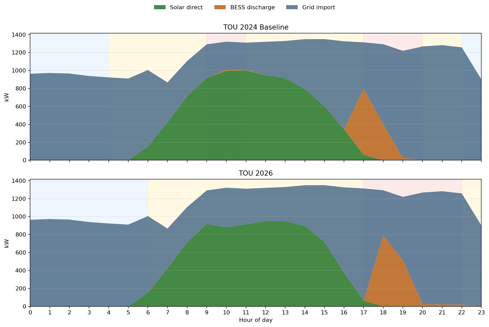

# Vietnam TOU 2026 Impact Report

## Executive Summary

- Worst revenue hit: Emivest Bundled Discount moved by -$63,305 (-11.26%).
- Best preserved case: Ecoplexus 40MW DPPA (CfD) moved by $1,348,006 (24.32%).
- Largest NPV movement: Ecoplexus 40MW DPPA (CfD) shifted by $11,798,735.
- Ecoplexus project IRR changed from 6.26% to 9.31%.

## Tariff Change Description

| Attribute | Old (<= April 21, 2026) | New (>= April 22, 2026) |
|---|---|---|
| Off-Peak (Mon-Sat) | 22:00-04:00 | 00:00-06:00 |
| Normal (Mon-Sat) | 04:00-09:30, 11:30-17:00, 20:00-22:00 | 06:00-17:30, 22:30-24:00 |
| Peak (Mon-Sat) | 09:30-11:30 and 17:00-20:00 | 17:30-22:30 |
| Sunday | Normal 04:00-22:00 / Off-Peak 22:00-04:00 | Normal 06:00-24:00 / Off-Peak 00:00-06:00 |
| BESS cycles/day | 2 | 1 |

## Per-Case Results

| Case | Scenario | Old Revenue | New Revenue | Delta Revenue | Delta Revenue % | Old IRR | New IRR | Delta IRR | Delta NPV | Old DSCR | New DSCR |
|---|---|---:|---:|---:|---:|---:|---:|---:|---:|---:|---:|
| Emivest | Bundled Discount | $562,144 | $498,839 | -$63,305 | -11.26% | 25.31% | 22.06% | -3.25 pp | -$659,445 | 1.96x | 1.64x |
| Emivest | Separate PV+BESS | $562,144 | $525,804 | -$36,341 | -6.46% | 25.31% | 23.61% | -1.70 pp | -$323,683 | 1.96x | 1.78x |
| Emivest | DPPA (CfD) | $562,144 | $542,467 | -$19,677 | -3.50% | 25.31% | 24.55% | -0.76 pp | -$116,188 | 1.96x | 1.86x |
| Emivest | Fixed EVN PPA | $562,144 | $556,068 | -$6,076 | -1.08% | 25.31% | 25.32% | +0.00 pp | $53,174 | 1.96x | 1.93x |
| Ecoplexus 40MW | DPPA (CfD) | $5,543,642 | $6,891,647 | $1,348,006 | 24.32% | 6.26% | 9.31% | +3.06 pp | $11,798,735 | 1.28x | 1.27x |

## Revenue Decomposition By Driver

| Case | Scenario | Driver | Value |
|---|---|---|---:|
| Emivest | Bundled Discount | Loss of morning peak uplift | -$65,343 |
| Emivest | Bundled Discount | BESS cycle reduction | -$32,609 |
| Emivest | Bundled Discount | Shifted peak window (timing) | $34,640 |
| Emivest | Bundled Discount | Off-peak rate changes | $7 |

## Average-Day Dispatch Chart

## Recommended Mitigations

- Re-price bundled and DPPA offers against the lower evening-only uplift, especially where solar no longer touches any peak block.
- Re-tune BESS dispatch toward evening peak capture and preserve state of charge during late-afternoon standard hours.
- Review customer discount assumptions separately for PV-heavy versus BESS-heavy products because the tariff shift hurts those revenue stacks differently.
- Keep both tariff baselines in regression artifacts until the 2026 schedule becomes the production default for every supported project type.
